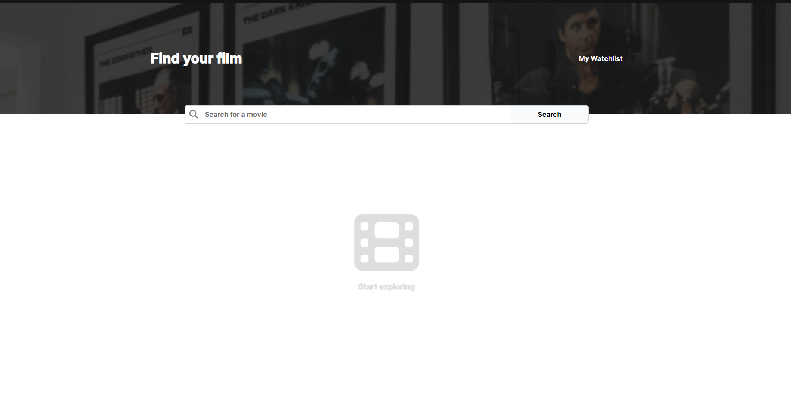
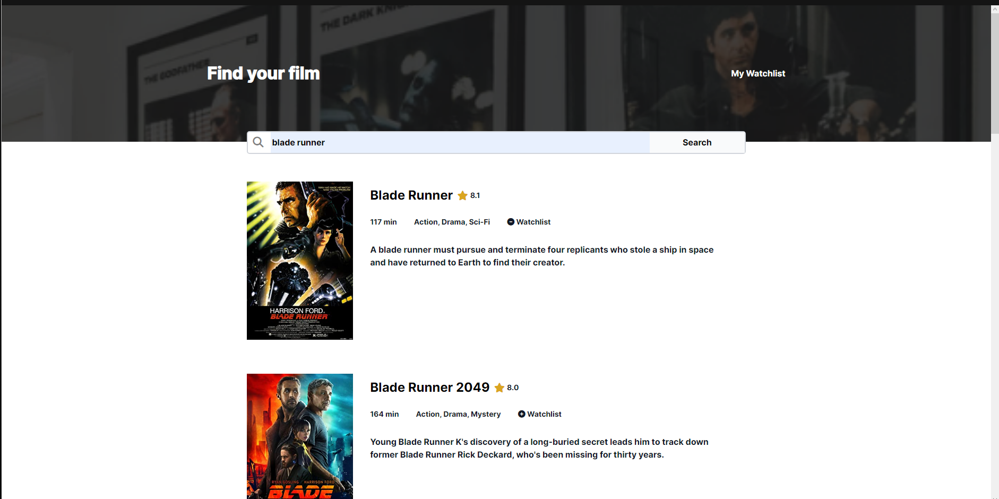
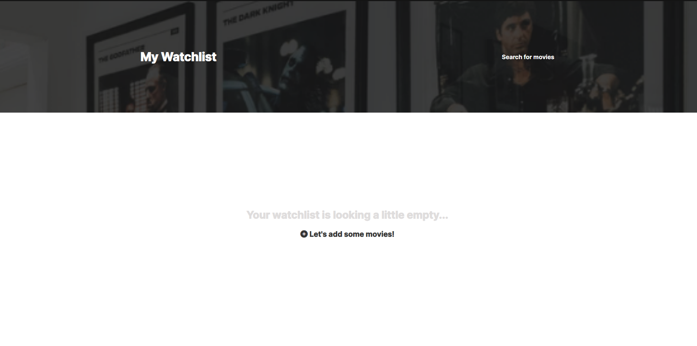
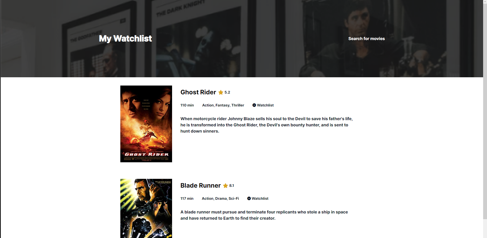

#  Movie Watchlist Project

Movie Watchlist Project from [Scrimba](https://scrimba.com/learn/frontend)'s Working With APIs module.

## Project Link 

[Project Link] https://movie-watchlist-project.netlify.app/ Hosted using Netlify 

## Previews

Home Screen

List of movies

Watchlist page (empty)

Watchlist page with movies

## Project Functionality

- Allows users to search for a movie to add to a watchlist.
- Movies are generated based on the user's search displaying their titles, ratings, runtimes, and genres.
- Users can add and remove movies from their watchlist by a watchlist button assigned to each movie
- Users can view all movies added to their watchlist